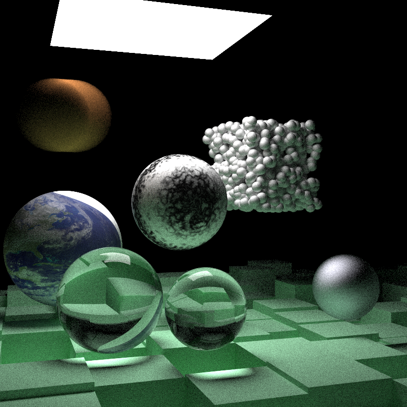

## Rust implementation of Peter Shirley's [Ray Tracing the Next Week](http://in1weekend.blogspot.com/2016/01/ray-tracing-second-weekend.html)

Rough list of changes from the C++ version
* Rc for struct pointers
* Materials are in an enum
* Traits instead of classes
* Option return type instead of bool + pointer input
* [image](https://github.com/PistonDevelopers/image) crate for using an image as a texture
* [Amy Williams's](https://www.tandfonline.com/doi/abs/10.1080/2151237X.2005.10129188) implementation of bounding box hit instead of the book version

Run as "cargo run --release > image.ppm"

TODO:

- [ ] Fix image texture
- [ ] Fix subsurface sphere
- [ ] Parallelize
- [ ] SIMD
- [ ] write to file/different formats?
